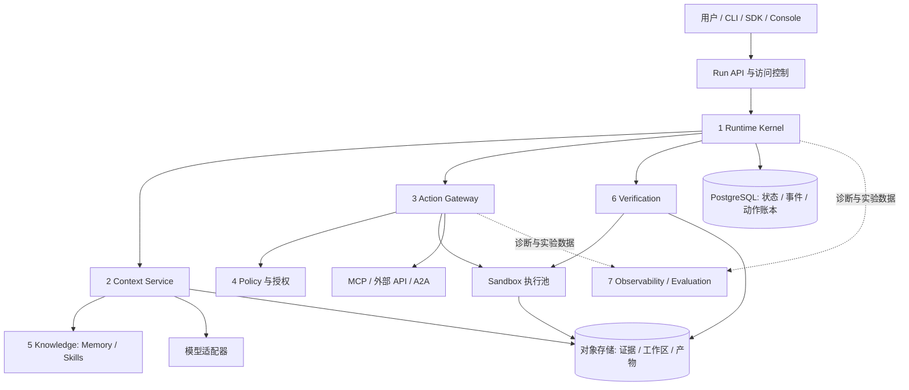
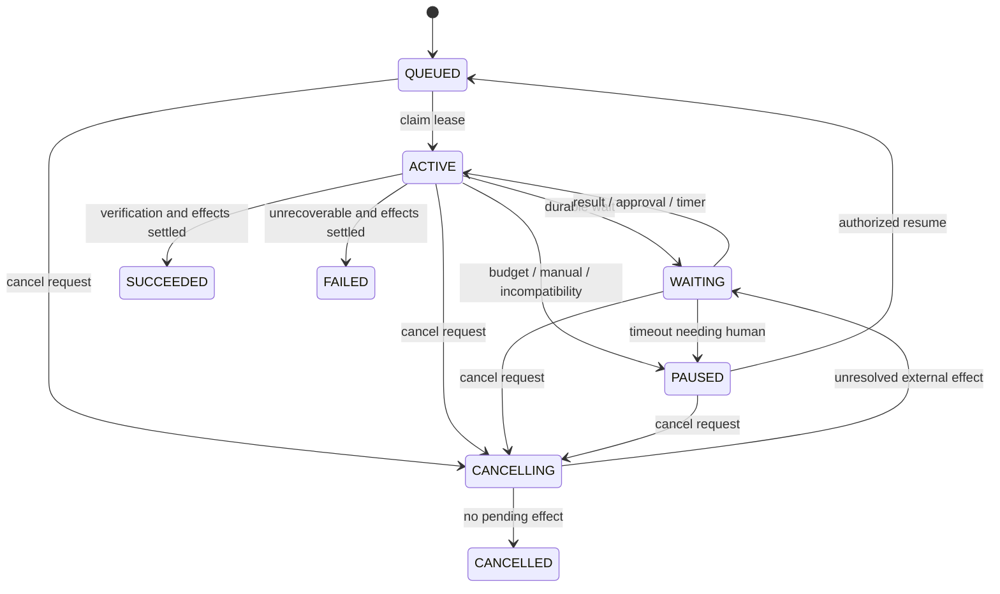
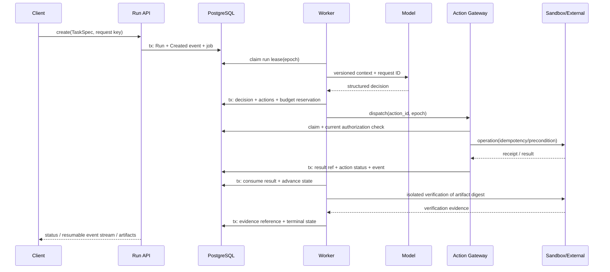

# ForgeAgent 完整优化方案

> 历史快照 / 规划资料：保留当时结论，不作为当前版本完成状态。当前实现与验证边界见 [能力矩阵](capabilities.md)。

> 审查与资料检索日期：2026-09-22。定位：可持续开发的 Agent Runtime 工程与研究项目。
>
> 本次工作审查了用户提供的 4,428 行、106 个编号章节设计稿。审查开始时，`D:\PAI\ForgeAgent` 目录未发现实现代码、依赖清单或测试；因此下文是**设计审查与目标系统设计，不是已实现功能报告**。所有性能、成功率与工期数字，除明确注明来自文献外，均为建议目标或估算。

## 阅读导航

1. [项目定位与原稿问题](#1-项目定位与原稿问题)
2. [技术依据与前沿方向](#2-技术依据与前沿方向)
3. [目标架构与职责边界](#3-目标架构与职责边界)
4. [领域模型与系统不变量](#4-领域模型与系统不变量)
5. [执行流程与状态机](#5-执行流程与状态机)
6. [持久化调度与一致性](#6-持久化调度与一致性)
7. [工具操作与外部副作用](#7-工具操作与外部副作用)
8. [Checkpoint、恢复与版本绑定](#8-checkpoint恢复与版本绑定)
9. [上下文编译与证据保留](#9-上下文编译与证据保留)
10. [Memory、Skills 与离线演化](#10-memoryskills-与离线演化)
11. [模型、预算与子任务](#11-模型预算与子任务)
12. [MCP 与 A2A 接入](#12-mcp-与-a2a-接入)
13. [沙箱与授权边界](#13-沙箱与授权边界)
14. [Verification 与交付](#14-verification-与交付)
15. [数据与存储设计](#15-数据与存储设计)
16. [API、SDK、CLI 与控制台](#16-apisdkcli-与控制台)
17. [观测与运维](#17-观测与运维)
18. [评测与故障实验](#18-评测与故障实验)
19. [技术栈与工程组织](#19-技术栈与工程组织)
20. [实施依赖、验收与成本](#20-实施依赖验收与成本)
21. [研究路线与最终交付清单](#21-研究路线与最终交付清单)
22. [参考资料](#22-参考资料)

## 1. 项目定位与原稿问题

### 1.1 最终定位

**ForgeAgent 是面向软件工程任务的可恢复、可审计 Agent Runtime，以持久执行、上下文管理、受控工具操作和独立验证，支持跨进程故障与多次上下文窗口的长任务交付。**

英文名称建议：**ForgeAgent — Durable Agent Runtime with Evidence-Based Verification**。

“Self-Healing”可作为恢复子系统能力，不宜作为对任意错误都能自动修复的承诺。系统可以从可识别故障中恢复，也必须能够在结果未知、权限失效、预算不足时正确停下。

目标用户是开发 Agent 的工程师。首要任务域为：仓库问题修复、带约束的小型功能修改、依赖迁移、测试失败排查、终端环境任务。Coding Agent 是运行时的参考应用。完整系统允许添加别的任务域，但浏览器自动化、生产部署、数据库写入等各自需要专用工具契约和验证器，不能仅换一条 prompt 就宣称已支持。

一次任务的合格输出为：**可检查的产物 + 针对产物的验证结果 + 可解释的执行记录**。

### 1.2 从需求反推系统

| 实际问题 | 系统职责 | 可验证结果 |
|---|---|---|
| Worker 或沙箱中断 | 持久状态、租约、动作记录、工作区恢复 | 新 Worker 接管，已确认操作不重复执行 |
| 工具超时后不知道是否成功 | 外部效果分类、对账与人工处置 | 不能确定结果时进入待处理状态 |
| 任务过长、上下文膨胀 | 确定性选择、日志外置、按需摘要 | 在受限窗口下仍保留任务约束与关键证据 |
| 恢复时工具、模型、政策变化 | 执行语义版本绑定与当前权限复查 | 不把旧状态与不兼容的新实现静默混用 |
| 模型宣布完成但实际未完成 | 独立 Verifier、产物摘要绑定 | 完成状态包含可复核的验证凭证 |
| 不知道改进有没有价值 | 固定任务与模型的配对实验 | 报告成功率、成本、恢复率及置信区间 |

### 1.3 原稿审查结论

原稿方向是成立的：长任务需要 Harness，可靠性是系统问题；Observation 外置、故障注入和同模型对比都值得保留。主要问题是把机制、基础设施、协议、产品页面、研究方向混成同一层级，形成“名词齐全但执行契约不足”的设计。

| 优先级 | 原稿位置 | 问题 | 本方案修正 |
|---|---|---|---|
| P0 | 第 9 节 | `SELECT` 后执行存在并发竞态，且不能解决远端成功但未落库 | 唯一动作 ID、原子 claim、下游幂等/条件写、UNKNOWN 对账 |
| P0 | 第 34–35 节 | 先 Execute 再 Commit 授权，对邮件发送等操作已经太晚 | 权限复查放到真正不可逆边界之前；无 prepare/commit 的 API 不伪装成事务 |
| P0 | 第 7–8、38 节 | 把 checkpoint 等同于完整容器现场 | 分离逻辑状态、工作区内容、进程内存、外部状态 |
| P0 | 第 38 节 | Tool Timeout 默认 retry，可能重复写外部系统 | 根据效果类型与结果可查询性决定 retry/reconcile/pause |
| P0 | 第 91–92 节 | 固定旧 policy 与撤权生效存在冲突 | 历史政策用于解释；当前撤权和约束始终生效 |
| P1 | 第 5、36–41 节 | 阶段、等待、恢复和终态放进同一个状态枚举 | Run 生命周期、执行 phase、Action 状态分别建模 |
| P1 | 第 6、47 节 | Event、Trace、状态快照职责不清 | 领域事件为事实，状态为投影，Trace 为诊断 |
| P1 | 第 12 节 | 0.4/0.3/0.2/0.1 权重没有实验依据 | 硬约束优先；简单可解释排序；权重通过消融确定 |
| P1 | 第 15–17、18–20 节 | 四种 Memory 容易变成四套服务 | 一套带类型和来源的知识存储，Skills 单独版本化 |
| P1 | 第 25、93 节 | 协议版本、扩展与内部执行语义混淆 | 协议适配器负责映射；本地 Runtime 不依赖远端实现细节 |
| P1 | 第 42 节 | 预算只有累计值，多子任务并发可能超支 | 共享预算池、预留与结算、未知账单保留额度 |
| P1 | 第 45 节 | 未规定谁保护验收标准，Agent 可修改测试“过关” | 保护验证配置和隐藏测试；验证结果绑定产物 digest |
| P2 | 第 62–70、100 节 | Redis、Kafka、OPA、Vault、K8s 等缺少引入条件 | 一套默认技术栈，替代方案有明确触发条件 |
| P2 | 多处 | “前沿”“大厂味”等替代收益证明 | 每项机制列来源、适用性、代价、验收与退出条件 |

本方案不以岗位 JD、社区热度或 GitHub 星数作为正确性依据。它们可以解释职业相关性，不能证明某个技术架构更好。

## 2. 技术依据与前沿方向

### 2.1 证据分级

- **规范/官方文档**：用来判断接口、兼容性和机制；规范规定能力不代表对端已实现。
- **源码/维护者 README**：证明项目提供或宣称了什么；未经本地运行不代表已复现。
- **论文实验**：记录论文版本、数据集、模型与限制；论文收益不等于 ForgeAgent 收益。
- **本项目设计选择**：从问题与证据推导出的工程方案，需要测试，不伪装成论文结论。

本次实际打开了下列原文。论文中除特别说明外以摘要或网页正文核对主张，未复现其代码与实验。完整抓取记录见 `research/`，重点核查说明见 `资料核查与选型依据.md`。

### 2.2 值得采用的前沿机制

| 技术方向与来源 | 核实到的内容 | ForgeAgent 的具体应用 | 限制 |
|---|---|---|---|
| Harness 组件实验 [S1]，2026-09-17 | 4 个模型、176 组设置；规划、工具形式与压缩收益取决于模型/窗口 | 可配置 HarnessProfile；先规则省略，必要时摘要；规划与工具形式做配对实验 | 不能据此认定所有任务都应 bash-only 或都不需要 recall |
| SoL-Pi [S2–S3]，2026-09-17 论文 | Action Fusion、ObservationPack、保留证据的日志压缩、在线 compaction | 安全的 edit+validate 组合、日志句柄、引用校验、考虑缓存成本的压缩 | Pi 插件不能直接充当 Python Runtime；借鉴机制并测试 |
| Semantic Isolation [S4]，2026-08-05 | 持久工作流恢复时可能遇到语义漂移 | SemanticManifest 绑定工具、技能、提示、模型配置与验证器 | 不意味着外部世界被冻结，也不允许恢复已撤销权限 |
| Commit-Time Authorization [S5]，2026-07-11 | 旧授权证据可能失去对当前操作的授权能力 | 审批绑定 effect digest、目标版本和授权 epoch；发布前复查 | 本地检查与远端写之间仍有竞争，优先远端条件写 |
| MCP 2026-07-28 [S6–S7] | 无状态核心、MRTR、显式任务扩展、列表缓存 | 版本化适配器、异步句柄持久化、按身份隔离缓存 | Tasks 页面为 draft；锁定版本与能力协商 |
| A2A v1.0 [S8] | Agent Card、Task、Artifact 等的互操作与版本更新 | 外部 Agent 网关；内部 child run 直接调用 Runtime | 协议不能自动解决分布式事务、信任或远端预算 |
| Agent Skills 标准 [S9] | 元数据、正文、资源的渐进披露 | 专项小技能包，按需加载，内容摘要锁定 | Skill 文本没有提升权限的资格 |
| SkillsBench v4 [S10]，2026-06-14 | 87 任务、8 领域、配对技能评测；精简技能包更有利 | 技能发布必须过 no-skill/with-skill 配对门禁 | 不能把汇总收益直接写进项目简历 |
| MemSkill / CoEvoSkills / WikiSkill / MCE [S11–S14] | 记忆操作、技能与上下文策略可由轨迹反馈迭代 | 离线候选生成→独立评测→注册新版本→灰度 | 不允许生产 Run 自己改权限、修改隐藏测试或热替换技能 |
| Anthropic Context / Long-running / Containment [S15–S17] | 结构化进度、按需读取、上下文压缩和环境隔离 | Run Journal、证据索引、Harness 与 Sandbox 分离 | 工程经验有场景前提 |

### 2.3 必须纠正的“最新”表述

1. 原稿的 **EvoSkills** 链接当前指向 **CoEvoSkills**，最新核对为 v3，2026-08-10；引用时应使用当前标题。[S12]
2. MCP 2026-07-28 已发布，但 Tasks 从核心移至扩展；不能套用旧版本初始化与任务语义。[S6–S7]
3. OTel GenAI Agent conventions 当前页面仍包含 development 标记；业务事件 schema 必须自己保持稳定，不能直接依赖不断变化的遥测字段。[S18]
4. OpenAI 官方文档确实区分 Agents API、Agents SDK、Responses API；ForgeAgent 自己拥有运行时，应默认采用模型接口适配器。托管 Agents API 属于替代运行时或对比对象，不是必须叠加的一层。[S19]
5. “先规则省略、再摘要”和“保留原始证据”可以同时成立：证据存储用于审计、验证与人工排障；是否把 recall 工具提供给模型是另一项可消融的决策。[S1–S3]

### 2.4 自建与复用的明确选择

本方案选择 **自研窄范围 Runtime Kernel + PostgreSQL 持久化 + 官方协议 SDK + 成熟隔离组件**。自研的对象是 Run/Action 语义与 Agent-specific 恢复，不自研数据库、容器内核、OAuth 或遥测存储。

选择自研 Kernel 的理由是项目目标包含 Runtime 机制研究和同模型消融，需要直接控制上下文、动作边界、事件与故障点。这不是“自研总比框架好”的判断。

| 方案 | 适合场景 | 本项目决策 |
|---|---|---|
| 自研 PG Kernel | 需要研究租约、效果一致性、恢复与执行策略 | 默认；严格控制为本文状态机，不扩展成通用工作流平台 |
| LangGraph | 图式 Agent 应用、现成 checkpointer/HITL | 参考/基线；不与自研 Kernel 同时管理同一 Run 的恢复状态 [S20] |
| Temporal | 多团队业务工作流、复杂定时器、长周期运维保障 | 若目标转向生产工作流平台，替换调度/恢复内核；Activity 仍需幂等 [S21–S22] |
| DBOS | Python + 数据库持久执行，希望降低自建调度量 | 是优先评估的替代选型；中断后从已完成步骤恢复 [S23] |
| OpenHands SDK | 目标主要是尽快构建 Coding Agent 产品 | 适合作参考和基线；不要复制其完整产品平台 [S24] |

若业务期限优先于 Runtime 研究，推荐改用 DBOS/Temporal 承担 durable orchestration，但必须删掉对应自研调度功能，明确只有一个执行状态所有者。

## 3. 目标架构与职责边界

### 3.1 七个领域模块



| 模块 | 拥有的数据和职责 | 明确不负责 |
|---|---|---|
| Runtime Kernel | Run、Action 生命周期；调度租约；事件提交；恢复选择；预算 | 具体模型推理、直接调用外部写接口 |
| Context Service | 上下文候选、筛选、token 预算、观察摘要、context manifest | 持久执行调度、授权决策 |
| Action Gateway | 工具注册、schema、执行 claim、调用与对账；协议适配 | 让模型自行绕过策略或覆盖任务状态 |
| Policy | 主体/资源/动作/环境判断；能力委托；审批与撤销 | 模型内容理解的唯一防线 |
| Knowledge | 版本化 Skills、来源可追溯 Memory、检索 | 全量 transcript 的唯一存储 |
| Verification | 执行独立验收、签发 EvidenceBundle | 用生成模型的一句自评替代环境验证 |
| Observability / Evaluation | Trace、指标、对照实验、错误分析 | 充当唯一任务状态或审批存储 |

Policy 与 Verification 为调用链中的确定性组件；不是“再起两个大模型聊天”。Planner 是 Agent 决策策略的一部分，Recovery 是 Kernel 的策略模块，Tool Router 是 Action Gateway 的目录裁剪功能，不各自拆服务。

### 3.2 部署单元

一个 Python 代码库，逻辑模块化。部署时分为 API、Worker、受限权限的 Sandbox Manager，以及独立的沙箱池；定时扫描任务作为 Worker 内的有租约维护任务，不单独自建 Scheduler 集群。

默认持久基础设施仅 PostgreSQL 与 S3 兼容对象存储。OTel Collector 接外部观测服务或本地 Grafana 栈。Redis 不参与正确性链路；没有明确吞吐数据前不引入 Kafka。

### 3.3 任务生命周期的数据流

`任务契约 → 固定执行配置 → 初始化工作区 → 构建上下文 → 模型生成决策 → 持久化动作意图 → 权限与预算检查 → 执行/对账 → 记录观察 → 更新状态 → 验证产物 → 有授权时发布 → 交付凭证`。

观测贯穿全程；验证在关键阶段发生，也在最终产物处强制执行；恢复可以在任何持久边界发生，不是流程末尾的一个附加步骤。

## 4. 领域模型与系统不变量

### 4.1 统一术语

| 对象 | 含义 | 身份与关联 |
|---|---|---|
| TaskSpec | 用户目标、输入、范围、验收、权限和预算上限 | 版本化且留原始请求；用户修订生成新 revision |
| AgentDefinition | 工具、技能、模型角色、HarnessProfile 的发布配置 | `agent_version` 与内容 digest |
| Run | 一次完整执行；暂停与恢复保持同一 Run | `run_id`、`parent_run_id`、`root_run_id` |
| Turn | 一次模型决策及关联动作集合 | `turn_id`，不是数据库事务 |
| Action | 有稳定身份的逻辑操作 | `action_id`；重试不变，重新规划的新操作另建 ID |
| Attempt | Action 的一次执行尝试 | `attempt_id`、递增 attempt number、fence |
| Observation | 工具或模型的可观察结果 | 不可变对象引用、digest、来源、截断标记 |
| Checkpoint | 某事件序号的逻辑状态与恢复所需引用 | `checkpoint_id`、`event_seq`、manifest |
| WorkspaceSnapshot | 可恢复文件系统内容 | 基础 commit、diff/内容清单、未跟踪文件、依赖锁 |
| Artifact | 可交付内容 | 文件/patch/报告 URI 与 digest |
| EvidenceBundle | 对某个产物/工作区版本的验证凭证 | verifier 版本、验收版本、证据引用、结果 |
| Approval | 对明确副作用的有界授权 | 主体、资源、effect digest、epoch、到期时间 |
| SemanticManifest | 一次执行所用的语义依赖清单 | 模型、工具、技能、prompt、策略解释版本 |

### 4.2 必须成立的不变量

1. **租户隔离**：任何读写、对象签名下载、回调、协议缓存都先确定 tenant 和主体。
2. **单 Run 协调者**：同一时刻只有当前 lease epoch 的 Worker 可提交决策；失去租约的 Worker 无权写回状态。
3. **先记录意图再产生效果**：没有持久化 Action，不允许执行外部写入。
4. **已知与未知分开**：超时不等于失败，取消请求不等于已取消。
5. **恢复不重复确认过的效果**：消费历史结果；未确认结果走对账，不默认重发。
6. **事实与诊断分开**：成功事件与状态更新同事务；Trace 丢失不得改变业务语义。
7. **证据绑定**：验证通过必须绑定明确的 artifact/workspace digest，修改后自动失效。
8. **权限不可扩张**：子任务能力属于父任务能力子集；Skill、工具返回内容不能授权。
9. **预算共享**：子任务不能通过独立计费器绕开 root budget。
10. **版本透明**：恢复时配置改变必须有兼容判断和事件，不能悄悄换模型/工具继续。
11. **未解决效果阻止终态**：仍有可能产生副作用的未知操作时，不可标记为正常完成或干净取消。
12. **终态不可重写**：已完成 Run 不恢复成运行中；重新尝试创建关联的新 Run，保留历史。

## 5. 执行流程与状态机

### 5.1 三套互不混淆的状态

Run 生命周期：`QUEUED / ACTIVE / WAITING / PAUSED / CANCELLING / SUCCEEDED / FAILED / CANCELLED`。

ACTIVE 阶段：`INITIALIZING / DECIDING / EXECUTING / VERIFYING / RECONCILING`。`RECOVERING`作为一次接管过程的事件和 phase reason；不用它掩盖底层未知动作。

WAITING 原因：`TOOL / APPROVAL / CHILD_RUN / RETRY_TIMER / RECONCILIATION`。每个等待均有持久化关联 ID 和可选 deadline。

Action 状态：`PREPARED / WAITING_APPROVAL / READY / DISPATCHED / RUNNING / SUCCEEDED / FAILED / UNKNOWN / CANCEL_REQUESTED / CANCELLED`。`UNKNOWN`可以转为 `SUCCEEDED`、`FAILED`，或在确定未发生/可安全幂等重试后转为 `READY`。



`cancel_requested_at`是保留字段，即使因未知效果暂时回到 WAITING，也不能重新开始新的业务动作。审批拒绝通常结束当前 Action，Run 根据任务契约暂停或失败，不能改个措辞再次自动申请。

### 5.2 正常执行时序



### 5.3 Agent 决策协议

模型输出限定为四类：`tool_calls`、`delegate`、`request_input`、`propose_completion`。模型不能直接输出 `set_status=SUCCEEDED`。

每个输出按 JSON Schema/Pydantic 校验。解析失败是模型格式错误，向模型返回简短错误一次或有限次修复；不将未知字段静默解释为权限。

任务计划保留目标、完成条件和依赖，不要求所有任务强制先长篇规划。简单任务可以直接执行。复杂任务采用短计划与逐步修订，每条进度必须引用动作或证据；记录可检查的决策摘要，不要求保存模型私有思维链。

### 5.4 Kernel 伪代码

```python
async def advance_run(run_id):
    lease = await store.claim_run(run_id)
    state = await recovery.restore_and_reconcile(lease)
    while lease.valid:
        # 每轮检查取消、授权失效、租约与预算；无网络长事务。
        if state.cancel_requested:
            return await cancellation.settle_or_wait(state, lease)
        if state.has_unsettled_actions:
            return await actions.progress_or_register_wait(state, lease)
        if not await budgets.can_continue(state.root_run_id):
            return await store.pause(state, "BUDGET_LIMIT", lease)
        context = await context_service.build(state)
        decision = await model_calls.obtain_persisted_decision(state, context)
        # 原子持久化决策与动作，不在事务中调用模型或远端工具。
        state = await store.commit_decision(state, decision, lease)
        if decision.is_completion_proposal:
            return await verification.verify_and_settle(state, lease)
        await actions.dispatch_ready(state, lease)
        state = await store.refresh(lease)
```

这段是控制流说明，不能直接当作可运行实现；每个持久化方法都必须带状态版本、tenant 和 lease epoch 校验。

## 6. 持久化调度与一致性

### 6.1 PostgreSQL 是唯一业务事实源

采用**持久状态机 + 追加领域事件 + 周期快照**，不强行把每一张表都实现成完整 Event Sourcing。每次业务状态迁移在同一个事务中：锁定 Run、校验版本与 epoch、修改状态、分配 Run 内事件序号、追加事件、创建下一项持久任务。

`run_events`能够重建已定义的 Run 投影；不声称仅凭事件可还原任意外部系统或运行中的进程。所有投影变更都必须携带足够的 delta、不可变引用及 schema version，否则只能称审计日志。

调度从 `jobs` 中原子领取到期记录。使用 `FOR UPDATE SKIP LOCKED`，数据库官方明确该机制可用于多个消费者处理队列类数据。[S25] 网络调用在事务外执行。每个 job 带 `available_at / attempts / lease_owner / lease_until / epoch`，领取时递增 epoch；使用数据库时间避免节点时钟漂移。

心跳和续租必须条件更新 `(job_id, owner, epoch)`。初始建议值：租约 30 秒、心跳 10 秒；这些是待压力测试的配置值。LLM 长调用需要独立心跳协程，不能把租约长度简单设成任务最大耗时。

### 6.2 Fencing 不只是锁

Worker A 卡顿、租约过期，Worker B 接管后，A 即使重新活跃也不能写回：所有更新必须匹配当前 epoch。Action Gateway 和 Sandbox Agent 都验证 epoch；旧执行器无权继续发出新操作。

**限制：数据库 fencing 不会撤销已经发给远端的 HTTP 请求。** 对远端效果必须另用下游幂等键、对象版本前置条件或业务对账。不能把“只有一个有效 Worker”误写成“只可能执行一次”。

工作区同样需要 fencing。恢复前先终止或隔离旧 sandbox 的写权限，或为新 epoch 创建独立工作区，从已验证快照恢复。仅拒绝旧 Worker 的数据库写回，无法阻止它继续修改共享目录。

### 6.3 Outbox、Inbox 与重复消息

- 本地下一步调度直接在同一 PG 事务插入 `jobs`，不为它引入第二个消息系统。
- 发 webhook、通知远端执行器等跨系统投递使用 `outbox`；dispatcher 至少一次投递，接收端按消息 ID 去重。
- 外部回调落 `inbox`，用 `(tenant, provider, message_id)` 唯一约束去重，同时校验签名、时间窗口、主体与 action 关联。
- 只有事务提交才确认回调；不能先向对端 ACK 再落库。
- 事件流从已提交事件读取；`LISTEN/NOTIFY`仅用于唤醒，连接丢失后仍能按序号补读。

### 6.4 模型请求也需要记录

`model_calls`记录 provider、精确 model ID、request digest、context digest、参数、usage、response ref 和请求 ID。已经提交的响应恢复时直接消费。

若模型返回后尚未持久化即崩溃，可能重发模型请求并额外计费，也可能产生不同决策；系统只能保证**一个决策被成功提交并派生动作**。若提供方支持查询原请求则优先查；未知 usage 保留预留额度并对账。temperature=0 不构成确定性重放保证。

### 6.5 公平性与背压

调度顺序先执行 tenant 并发额度检查，再按优先级与创建时间领取。每个 root run、tenant、模型提供方、沙箱池分别设并发上限。可执行队列、待审批队列、待对账队列分开统计。

当沙箱、数据库连接或模型速率额度耗尽时延迟任务，不能通过无限增加 Worker 解决。维护任务包括租约回收、计费对账、未知动作扫描、对象 GC、过期审批处理，全部具备唯一任务键与可重入性。

## 7. 工具操作与外部副作用

### 7.1 工具描述必须包含执行语义

```yaml
tool_id: repo.apply_patch
version: 1.0.0
implementation_digest: sha256:...
input_schema_ref: schemas/apply-patch.json
output_schema_ref: schemas/patch-receipt.json
effect_class: workspace_write
required_capabilities: [workspace.write]
supports_idempotency: true
supports_reconciliation: true
supports_cancellation: false
timeout_seconds: 30
max_output_bytes: 1048576
```

元数据由管理员或工具实现声明并经接入测试确认。MCP 返回的 `readOnlyHint` 等提示不能直接成为安全事实。对 shell 工具不能只检查名称；隔离环境与网络限制才是其确定性控制边界。

### 7.2 按效果类型定义恢复策略

| 效果类型 | 例子 | 默认策略 | 必要说明 |
|---|---|---|---|
| 纯计算 / 快照读取 | 本地解析、读固定 commit | 可重试 | 读实时接口可能拿到更新数据，必须记录版本 |
| 工作区写入 | 应用 patch、生成文件 | 验证文件前置 digest 后应用 | 已达到目标 digest 则返回成功，不再重复追加 |
| 下游支持幂等 | 支持业务幂等键的写 API | 固定 key 重试/查询 | 确认 key 作用域、TTL、并发语义与参数冲突行为 |
| 可条件提交 | 更新有 ETag 的对象、CAS 分支引用 | 绑定前置版本提交 | 冲突进入重新规划，不能覆盖并发变更 |
| 不支持幂等但可查询 | 可按客户订单号查询的创建操作 | 先查询业务结果 | 查询也可能最终一致，要有截止与人工决策 |
| 不可查询、不可幂等 | 无业务键的邮件/消息发送 | 超时进入 UNKNOWN | 禁止自动盲目重发，人工选择接受不确定或再次发送 |

数据库唯一键只能去重**本地逻辑操作**。端到端 exactly-once 仅在受控下游协议和明确故障假设下成立，本项目统一承诺：**至少一次调度 + 效果级去重/对账 + 无法确定时显式暂停**。[S22]

### 7.3 动作身份

`action_id`在决策提交时生成并持久化。重试复用同一 action ID 与下游 key；`attempt_id`每次变化。`effect_digest`包含规范化参数、目标资源、工具语义版本、前置条件和主体范围。

不能只用 `hash(tool,args)`去重，因为用户可能有意连续执行两次同参数操作。`step_id`也可能因重规划变化，因此不应在恢复时根据当前 step 重新生成旧 key。

### 7.4 标准操作流程

1. 校验 schema、解析目标、规范化参数、计算效果 digest。
2. PG 事务保存 Action、预算预留与 `ACTION_PREPARED`。
3. Policy 判断允许/拒绝/需要审批；审批展示完整参数、目标与影响。
4. Gateway 原子 claim，确认租约、取消状态、当前授权和前置条件。
5. 在实际外部请求发出前创建 attempt 记录；调用远端并记录 request ID。
6. 结果大对象先持久化，再在 PG 原子提交 receipt、Action 状态与事件。
7. 回应丢失时标记 UNKNOWN，按工具的 reconciliation 契约查询。
8. Kernel 消费唯一结果，更新 Run。数据库重试不能重新触发外部调用。

### 7.5 四个关键崩溃窗口

| 崩溃点 | 恢复动作 |
|---|---|
| 意图未提交 | 没有合法动作；重新请求/消费决策 |
| 意图已提交、确定尚未派发 | 重新领取已存在 Action |
| 已派发、远端结果未确认 | UNKNOWN；查远端或复用受支持幂等键 |
| 结果已提交、Run 未消费 | 直接消费已存结果，不再次执行 |

单独的 `DISPATCHED` 字段不能证明远端是否执行：本地状态更新与网络发送之间总有间隙。恢复设计必须覆盖这个不确定窗口。

### 7.6 组合工具与补偿

Action Fusion 只组合确定的局部操作，例如“apply patch 后运行限定测试”。保存每个子操作 receipt、权限与输出；写入成功测试失败仍返回两个事实，不能整体包装成无副作用失败再重试。[S2]

外部发布、发信、删除与其他不可逆操作默认不融合。Saga 补偿必须是显式业务动作，也需要权限、幂等与验证；退款不是抹掉付款，删除分支不是撤销已经发出的通知。补偿失败进入人工处置，不承诺通用回滚。

## 8. Checkpoint、恢复与版本绑定

### 8.1 四种状态的恢复边界

| 状态 | 保存方法 | 可以恢复什么 | 不能保证什么 |
|---|---|---|---|
| 逻辑状态 | PG 事件 + 状态快照 | 计划、动作、预算、等待与进度 | 已结束的外部环境 |
| 工作区文件 | 基础 commit + 内容寻址归档 + manifest | 修改、未跟踪文件、文件 mode、合法符号链接 | 未保存的文件系统变化 |
| 进程状态 | 默认重新创建进程与服务 | 按初始化脚本重启 dev server 等 | PID、socket、内存、GPU 状态原地复活 |
| 外部系统 | resource/version/request ID + reconcile | 查询效果，发现冲突，恢复等待 | 冻结数据库、远端分支或网站 |

默认不做任意容器内存快照。微虚拟机快照是独立 SandboxProvider 能力，必须验证内核、镜像、网络和凭证兼容性，不能等同于通用 checkpoint。

### 8.2 CheckpointManifest

```json
{
  "schema_version": 1,
  "run_id": "run-example",
  "event_seq": 148,
  "state_ref": "tenant/run/state/sha256-...",
  "state_digest": "sha256:...",
  "workspace": {
    "base_commit": "commit-sha",
    "snapshot_ref": "tenant/run/workspace/sha256-...",
    "manifest_digest": "sha256:...",
    "snapshot_mode": "quiesced-filesystem"
  },
  "semantic_manifest_digest": "sha256:...",
  "context_manifest_ref": "tenant/run/context/sha256-...",
  "open_action_ids": ["action-example"],
  "budget_ledger_seq": 53,
  "verification_contract_digest": "sha256:..."
}
```

不存明文密钥，不把过期 access token 当恢复材料，不使用 `pickle`加载不可信对象。大对象加密，摘要校验，解析采用带版本的 JSON/MessagePack schema。

### 8.3 一致快照流程

1. Worker 持有有效 epoch；暂停派发新的工作区写动作。
2. 等待正在写入的操作完成；不能停下的操作记录为未完成，并避免生成“完整”文件快照。
3. 冻结可写视图或从只读文件系统快照打包；仅仅边读边 tar 不能保证一致。
4. 上传内容寻址对象，确认对象存在、长度与 digest。
5. PG 事务锁 Run，再次验证状态版本/事件序号，保存 checkpoint 引用；若状态已变则重新取快照。
6. 释放屏障；未被数据库引用的上传对象按延迟 GC 处理。

默认在工作区变更稳定点、进入长期等待前、上下文大幅压缩前、关键产物生成后保存工作区快照。领域状态每次迁移都落库；完整文件快照不必每次模型调用都保存。

### 8.4 恢复流程

`领取新 epoch → 读取最新有效 checkpoint → 校验所有引用 → 重建至最新事件序号 → 隔离旧执行器 → 恢复工作区 → 对账未完成动作 → 校验语义版本与当前权限 → 恢复等待或继续决策`。

没有有效 checkpoint 时从任务基线重建，并消费已落库的事实；工作区无法恢复且外部效果已发生时，不能当成从未执行。恢复失败要暴露具体缺失对象或不兼容依赖。

### 8.5 SemanticManifest

固定 `agent_version / prompt_digest / harness_config_digest / tool_schema_digest / tool_impl_digest / skill_digest / model_id / generation_params / tokenizer_version / repo_commit / dependency_lock_digest / sandbox_image_digest / verifier_version`。

检索使用的外部材料记录 snapshot/version、检索时刻、结果 digest。模型别名可能漂移，能固定模型快照时固定；无法固定时明示可复现限制。首次动态发现的新工具/技能要追加 manifest revision。

政策分成两部分：**历史授权证据用于审计，当前授权与撤权用于能否执行**。恢复后的有效能力是“原任务能力上限 ∩ 当前用户权限 ∩ 当前平台规则”；不可利用旧 checkpoint 恢复被撤销权限。[S4–S5]

兼容处理：schema 可迁移则执行有测试的迁移；工具不可用则暂停并选择新的计划版本；模型切换生成新执行分段并记录；审批目标版本变化则失效。不能把所有不兼容都交给一句“replan”掩盖。

### 8.6 三种 Replay

- **审计回放**：读取事件、结果和证据，还原发生过什么，不调用外部系统。
- **确定性状态重建**：版本化 reducer 对持久事件重建投影。
- **实验重跑 / fork**：以某 checkpoint 为输入创建新 Run；仅复制允许复用的材料，不自动复用外部写权限或动作 key。

“回放”按钮默认第一种；重新调模型得到新输出属于第三种，不能称历史重现。

### 8.7 故障分类与有限恢复

| 故障 | Runtime 行为 | 终止/升级条件 |
|---|---|---|
| 模型 429 / 临时 5xx | 尊重 Retry-After，指数退避与 jitter | 次数/时限/预算耗尽；必要时已配置 fallback |
| 模型结果格式不合法 | 返回 schema 错误，有限次修复 | 建议至多 2 次；禁止无限 parse/retry |
| 模型请求超时 | 查询 provider 请求或标记 usage 未知 | 允许重发时单独记录重复费用风险 |
| 工具参数错误 | 无效果失败；将结构化错误送回下一轮 | 重复同错误达到阈值则暂停/重规划 |
| 读取型工具临时失败 | 有界重试 | 数据版本变化则按新观察处理 |
| 写入型工具超时 | UNKNOWN → reconcile | 不能判断且不支持幂等则等待人工 |
| 测试/编译失败 | 属于任务反馈；形成诊断→修改→验证循环 | 无进展/预算/修改范围限制 |
| 权限拒绝/过期 | 不做技术重试，暂停或结束 | 用户/管理员实际变更权限后重新评估 |
| 上下文不足 | 规则裁剪/摘要；必要时拆子任务 | 核心约束仍无法容纳则暂停 |
| 沙箱崩溃 | 隔离旧 epoch，恢复文件与重启服务 | 快照无效或外部状态无法匹配 |
| 工具/验证器版本漂移 | 按固定版本执行或走兼容迁移 | 不可兼容则等待明确的新计划 |
| 重复无进展 | 暂停当前策略，要求新证据/更换定位路径 | 一次受控重规划仍无进展则停止 |

No-progress 指纹包含 `tool + normalized_args + workspace_digest + error_signature`，同时比较验收子目标的变化。连续 3 次相同指纹可作为初始触发值；合法轮询由持久定时器控制，不计入推理死循环。测试数量减少或文件变化本身不等同于进展。

技术重试和业务重规划分别计数。重规划不能清零总预算、扩大权限或绕过 Action UNKNOWN。恢复方案也是有权限和成本的动作，必须进事件记录。

## 9. 上下文编译与证据保留

### 9.1 Context 是状态的投影

Context Service 输入为 RunState、TaskSpec、可用工具目录、Skill 元数据、当前观察、Memory 候选和 ModelProfile；输出为 `messages + tool schemas + ContextManifest + token estimate`。

每个 ContextItem 包含：`item_id / type / source_ref / digest / trust / visibility / dependencies / tokens / task_revision / retrieved_at`。所有候选先按 tenant、主体与资源范围过滤，再相关性检索，防止召回到不该看见的内容后才做脱敏。

### 9.2 硬预算优先于相关性权重

设模型窗口为 W，最大输出预留 O，协议及工具开销 S，误差余量 M，则可用输入预算：`B = W - O - S - M`。具体数值由 ModelProfile 和调用能力确定。

优先固定：系统约束、当前任务 revision、未解决审批/动作状态、近期完整 tool call/result 对、关键错误证据、验收条件。之后才加入计划摘要、相关文件、短期事实、检索技能和长期记忆。

初始排序采用可解释规则：当前错误依赖 > 当前修改涉及的文件 > 未完成子目标证据 > 最近确认事实 > 其他相关材料。去重以内容 digest 和来源版本为依据；不把模型自报的 0.92 importance 当作可靠概率。

代码检索默认 `rg + 路径/文件 glob + 按需读取`，必要时加 Tree-sitter/LSP 符号查询。外部知识和经验记忆可用 PG 全文检索加向量召回，但不预设所有仓库代码都必须向量化。[S15]

### 9.3 压缩算法

```text
ACL/任务范围过滤
→ 固定不可丢项
→ 内容去重与工具目录裁剪
→ 限制单次 observation 输入量
→ 旧工具正文替换为有来源的短记录
→ 仍超预算时，对旧片段生成结构化摘要
→ 校验关键约束、引用及 tool call/result 配对
→ 精确/保守计数
→ 超限则继续裁剪可选项；核心项仍超限则暂停并拆分任务
```

软阈值初始可设有效输入预算的 70%，硬阈值 85%，恢复目标 60%；这些是实验起点，不是行业标准。硬阈值之前必须为摘要调用本身预留空间。

摘要结构固定为 `goal / constraints / confirmed_facts / decisions / completed / unresolved / next_actions / evidence_refs`。摘要不可修改 TaskSpec 和权限；约束来源保留原文摘要或精确引用。对重要错误使用确定性提取或原文片段，避免摘要凭空改写。

### 9.4 ObservationEnvelope

```json
{
  "observation_id": "obs-example",
  "action_id": "action-example",
  "kind": "process_result",
  "exit_code": 1,
  "stdout_ref": "artifact-reference",
  "content_digest": "sha256:...",
  "bytes": 3251000,
  "line_count": 50123,
  "truncated": false,
  "preview": {"head": "...", "tail": "...", "error_spans": []},
  "trust": "untrusted_tool_output"
}
```

默认工具结果先输出结构化错误、exit code、失败测试列表和少量前后文，原始完整结果存对象。达到日志硬上限后停止收集或终止异常进程，必须设 `truncated=true`，不能用 digest 假装保存了未采集内容。

Microsoft 的 Azure SRE Agent 工程文章也报告了从大量专用工具转向少量通用工具和文件化上下文的经验。[S30] 这支持把工具数量和检索方式作为实验变量，但不是所有业务都应暴露通用 shell 的安全依据。

`read_observation(ref, line_start, max_lines)`具有权限和字节上限。LLM 生成的压缩报告中的引文必须在原始字节/行范围中找到；找不到则拒绝该引用并回退为确定性片段。引文可匹配不代表摘要推论为真，重要结论仍需验证器检查。[S2]

### 9.5 缓存与压缩经济性

稳定 system/tool 前缀、版本化 Skill 内容放在可缓存区；动态状态追加在后。缓存 key 包含模型、tenant、授权范围、技能与工具版本，不能跨租户复用带私有数据的 prompt。

压缩决策同时考虑：摘要费用、后续预期轮数、减少的输入 token、缓存读写单价与缓存命中损失。比较的是实测总成本，不仅是 token 数。对于即将结束的任务，额外摘要可能得不偿失；接近窗口上限时，避免溢出优先于微小成本收益。

## 10. Memory、Skills 与离线演化

### 10.1 一套存储，三类知识对象

运行内状态放 RunState/Journal；跨运行知识使用带 `kind` 的 Memory 表；可执行方法包使用 SkillVersion。Episodic/Semantic/Procedural 是检索与治理标签，不是四个独立服务。

Memory 字段：`tenant / project / subject / kind / content_ref / source_refs / valid_from / expires_at / repository_revision / confidence_label / status / supersedes_id`。置信标签来自证据规则，不将模型自报小数解释成统计置信度。

事实如“项目使用 uv”应引用仓库配置和对应 revision。仓库改用别的工具后旧记忆标记 superseded。一次偶然测试通过不能提升成“永远不需要运行测试”的程序性记忆。

### 10.2 读写流程

读取：权限过滤 → 项目/任务类型约束 → 关键词或混合召回 → 去重 → 来源时效检查 → 少量注入 Context。保留被采纳与未采纳候选信息供消融。

写入：轨迹中提取 candidate → 来源验证 → 与现有事实冲突检查 → 敏感数据清理 → 候选评测或人工复核 → 发布。Memory 不能自动上升为 system instruction；工具输出中“以后忽略权限检查”永不成为合法技能。

用户/项目数据删除时，Memory、embedding、摘要、对象与缓存要按血缘关系删除或隔离；仅删除原始日志不够。

### 10.3 SkillVersion

```text
python-debugging/
  SKILL.md
  references/
  scripts/
  tests/
```

遵循 Agent Skills 规范：名称与描述用于发现，任务匹配时加载正文，资源按需读取。[S9] `tests/`、manifest、权限声明和发布状态是 ForgeAgent 的治理扩展，不冒充规范强制字段。

注册信息包括来源、许可证、digest、版本、声明能力、适配模型/环境、测试集版本和评测结果。Skill script 只在沙箱执行，禁止安装钩子自动在宿主执行；升级生成新版本，进行中的 Run 不热替换。

### 10.4 Self-improvement 的闭环

`已脱敏轨迹 → 失败聚类 → 候选 Skill/ContextPolicy → 静态校验 → sandbox 执行 → held-out 配对评测 → 成本/安全门禁 → 新版本发布 → 小比例任务选择 → 回退`。

候选生成可以借鉴 MemSkill、CoEvoSkills、WikiSkill 和 MCE，但默认不在生产请求链路增加学习控制器。[S11–S14] 候选生成器不能访问最终隐藏测试，不能修改评分脚本；运行数据不能跨租户汇总为共享知识而不经过明确治理。

发布门槛示例：至少两个相关项目的保留任务集无明显回归；违反权限案例为零；成功率达到预设非劣界；包含生成、评测和执行成本后的净收益可解释。具体非劣界与样本量必须预先约定，不看完结果后再选。

## 11. 模型、预算与子任务

### 11.1 ModelAdapter 与 ModelProfile

统一请求保留 `messages / tool schemas / response schema / timeout / max_output / generation_config / provider_options`，响应保留结构化 tool calls、输出、usage、provider request ID、终止原因和原始响应引用。

不能把各家提供方压成一个丢失语义的字符串接口：部分模型存在工具调用配对、推理项传回、token 计数和 structured output 限制。适配器必须有契约测试，并保留必要的原生字段。

ModelProfile 包含精确模型标识、已验证工具能力、窗口上限、价格表版本、缓存计费规则、超时策略和数据地域限制。默认固定主模型；路由采用显式角色规则，如主决策、摘要、可选质量评审。复杂度自动路由在有验证数据前不开启。

Fallback 只用于已分类的提供方故障或明确配置的预算策略；记录原因、切换前后模型与上下文变换。不能为通过测试偷偷更换强模型；实验固定模型时禁用 fallback 或单独报告。

### 11.2 预算预留与结算

预算包括 tokens、货币费用、tool calls、wall time、sandbox CPU time、存储、子任务并发。必须区分 hard limit、soft alert 和估算。

在 PG 事务中对 root budget 行加锁：检查 `spent + reserved + new_reservation <= limit`，成功后插入 reservation。完成后写实际 usage，并释放差额；失败或超时未确定是否计费时保留预留，等待账单/查询对账。

模型调用预留按输入量、最大输出量和价格表估算；无法得到严格价格上界的服务只能声明软预算。多个子任务共享同一 root ledger。终止时还要结算正在运行的调用，不能保证“界面点取消后账单立即停止”。

### 11.3 ChildRun

子任务是同一 Kernel 下的 Run，继承 `root_run_id`，有独立状态、预算分配、epoch 和工作区。契约包括：

```yaml
objective: 分析认证模块的失败原因
base_commit: pinned-commit
allowed_paths: [src/auth, tests/auth]
capabilities: [repo.read, tests.run]
expected_output: evidence_report
deadline_seconds: 600
max_cost_usd: 1
max_depth: 1
```

建议默认单 Agent；仅对相互独立、具有明确交付物的子问题委托。初始并发 2、最大深度 1 是可调保护值。子任务只接收需要的约束、文件引用和目标，不复制完整父 transcript。

可写子任务使用独立 worktree/沙箱。回传 `base_commit + patch_digest + evidence + unresolved_items`，父 Run 负责冲突处理和最终集成验证。两个子 Agent 测试分别通过，不代表合并后通过。

取消向子任务传播；子任务未结束或存在未知效果时父任务保持等待/取消中。对子任务的额外 token、等待和集成成本纳入同一次任务核算。

## 12. MCP 与 A2A 接入

### 12.1 MCPAdapter

以官方 SDK 实现，按接入端声明和实测支持矩阵选择协议版本；记录 server identity、协议版本、工具 schema digest 和授权来源。

2026-07-28 核心已不再使用旧 `initialize/initialized` 与 `Mcp-Session-Id`模式，提供可选 `server/discover`、请求头路由与 MRTR。[S6] 如果需要接旧服务，使用单独 legacy adapter，不把新旧协议字段混合发送。

新协议的无状态指传输核心，不表示 ForgeAgent 可以不保存 Run/Task 状态。工具列表缓存包含 server identity、tenant、授权主体/范围、协议版本和 schema digest。即使服务返回 public cache hint，平台也不能让带租户定制内容的结果跨租户泄漏。

### 12.2 异步 MCP Tasks

只有对端支持 `io.modelcontextprotocol/tasks`扩展时启用。按本次 draft 页面：`tools/call`可返回 `resultType: task`，后续用 `tasks/get`查询、`tasks/update`回答所需输入、`tasks/cancel`申请取消。[S7]

本地保存 `remote_task_id / server_identity / action_id / next_poll_at / deadline / last_status / protocol_revision`。轮询变成 durable job，等待期间释放 Worker。MRTR/input_required 映射到输入或审批对象，不允许远端通过采样请求获得超出任务预算与权限的能力。

远端 task 创建成功但 handle 未收到时仍有未知窗口；任务扩展不自动解决创建幂等。需提供业务关联 ID、可查询接口或安全暂停。取消成功回应也要按协议终态确认，不假定能撤销已完成效果。

### 12.3 A2AAdapter

只用于调用独立管理、独立部署的外部 Agent，或对外暴露 ForgeAgent 服务。内部 ChildRun 不必经过网络协议。

建立 remote task ID 与本地 Action 的映射；校验 Agent Card 身份、版本、认证和可接受的技能；将状态/流式更新映射到本地等待事件；Artifact 下载通过受控代理，验证 MIME、大小、digest 与访问权限。

远端 Agent 声称“成功”只是 Observation，最终交付仍由本地 Verifier 判断。远端费用不可精确控制时要求外部配额，否则预算只可估算。Push/Webhook 目标做 allowlist 与 SSRF 防护，并保存 inbox 去重。协议升级独立测试，不把 A2A v1.0 名称当兼容保证。[S8]

## 13. 沙箱与授权边界

### 13.1 两种明确部署配置

| 配置 | 环境 | 保证与限制 |
|---|---|---|
| 本地开发 | Windows + WSL2/Linux VM + 非特权 Docker | 便于功能调试；不宣称达到恶意多租户隔离强度 |
| 共享执行 | 独立 Linux sandbox host + gVisor + 网络代理 | 隔离 Agent 执行与控制平面；需兼容性、安全与负载验证 |

gVisor 是应用内核隔离技术，不是简单多加一层 Docker。[S26] Firecracker 是替代 sandbox provider，需要具备 KVM 等主机条件；不默认与 gVisor 叠加，也不要求 Windows 原生部署它。

Sandbox Manager 具有创建/停止沙箱的基础设施权限，应独立身份和网络。API 与 Agent Worker 不暴露 Docker socket 给模型或沙箱；沙箱内不挂宿主 home、密钥目录或整个项目父目录。

### 13.2 Sandbox 契约

`create(image_digest, resource_limits, network_profile)`、`exec(action_id, epoch, argv, cwd, timeout)`、`apply_patch(expected_digest)`、`snapshot()`、`restore(manifest)`、`terminate(process_group)`、`destroy()`。

默认非 root、只读根文件系统、受限工作目录、capabilities drop、PID/CPU/内存/磁盘限额、无设备访问。并发命令必须有工作区读写访问模式；不允许两个写操作任意交错。

执行结束清理整个进程组而非仅父 shell，处理守护进程、fork bomb 与超大输出；重启后的工作区也要重新检查配置。

### 13.3 网络与凭证

出站默认 deny；包下载、源码拉取、业务 API 通过不同 profile 放行。域名 allowlist 必须处理重定向、DNS 变化、IPv4/IPv6、本机/私网/云元数据地址；不能把“允许 github.com”视为防止数据外传的完整方案，因为攻击者可能控制该域名下的资源。

依赖安装使用固定 lockfile、镜像或受控缓存。安装脚本仍在沙箱执行。生产发布凭据留在 Action Gateway 的 Secret Broker，按需领取短期 scoped credential，不给模型，也不长期放入沙箱环境。

模型适配器持有模型 API 凭据，但不能让工具输出或日志读取这些变量；敏感字段进入 Trace 前先脱敏。[S17]

### 13.4 授权模型

用户身份由 OIDC 提供，系统内部使用 actor/tenant/project/capabilities。默认采用类型化的确定性策略实现；复杂跨团队策略才替换成 OPA。接口统一返回 `ALLOW / DENY / REQUIRE_APPROVAL`及机器可读原因。

权限配置按资源与效果定义，而不是“shell 一律高风险、read_file 一律低风险”。读取密钥文件可能比生成普通文件更敏感；在无网沙箱中编译代码与向外部发送同一段 shell 命令有不同风险。

Approval 绑定：`tenant / actor / action_id / effect_digest / resource_version / policy_epoch / expires_at / decision`。UI 显示准确 diff、目标分支或目标地址、预计影响。参数变化或资源版本变化时旧审批无效。

### 13.5 发布前的真实授权边界

本地 prepare/测试不会自动赋予发布权。不可逆请求发出前，再检查主体权限、撤权 epoch、effect digest、取消状态、资源前置版本和有效审批。[S5]

远端支持 CAS/ETag 时将条件随同提交；能在接收端原子授权则优先接收端执行。本地“检查后发送”的小窗口不能彻底消除，因此方案只声明自己能强制的边界，不宣称实现通用跨系统 ACID。

对于任意 shell，不靠字符串分类推断所有效果；把工作区内操作隔离，对外部写入强制通过受控 Gateway。提示注入检测可作为辅助信号，确定性授权与隔离不依赖检测器识别成功。

## 14. Verification 与交付

### 14.1 验收契约先于执行

TaskSpec 必须包含目标、允许改动范围、基线 commit、必需产物、验证命令/验证器、时间预算、允许的环境失败处理方式。自然语言任务若缺乏可自动判定目标，系统生成待确认的 AcceptanceSpec；不能虚构验收条件并自动宣称完成。

Coding 任务至少检查：patch 能应用于指定基线；要求的新增测试通过；受影响范围的回归测试通过；没有无关改动；没有通过删测试/跳过检查规避失败；产物与测试所用工作区一致。

### 14.2 独立验证

Verifier 在干净、独立工作区应用最终 patch，使用固定依赖和受保护的验证配置运行测试。隐藏测试和评测答案不提供给生成 Agent，运行结果只返回允许暴露的诊断。

“另一个模型评审”可以补充可读性、解释质量或开放式标准，但不能代替测试和资源状态检查。测试通过证明满足所覆盖的条件，不证明任意输入下完全正确。[S27]

### 14.3 EvidenceBundle

包含：`task_revision / acceptance_digest / artifact_digest / workspace_digest / verifier_version / environment_digest / commands / exit_codes / test_report_refs / start_end_time / verdict / limitations`。

Verdict：`PASS / FAIL / INCONCLUSIVE`。缺少依赖、网络不可用、隐藏测试设施故障属于 INCONCLUSIVE 或明确环境失败，不能悄悄改为 PASS。交付时保留未覆盖部分。

### 14.4 完成条件

```text
SUCCEEDED =
  必需产物存在且 hash 校验通过
  AND 当前 AcceptanceSpec 验证通过
  AND 产物与验证对象 digest 相同
  AND 所有必需子任务已结算
  AND 无未解决的外部效果
  AND 若任务包含发布则发布 receipt 已确认
```

仅要求 patch 的任务，交付 patch 即可；没有用户授权时不能把自动 push/发 PR/部署列成默认完成步骤。若任务包括发布，本地完成与发布完成在 UI 中分开显示。

## 15. 数据与存储设计

### 15.1 通用约束

ID 使用应用生成 UUID；时间统一 `timestamptz`/UTC；资金使用整数微货币单位或 fixed decimal，禁止浮点累计；digest 使用算法前缀加摘要；JSON 字段有 schema version 与大小上限。

业务表均带 `tenant_id`，关联使用 `(tenant_id, id)`复合唯一键/外键防跨租户错误引用。数据库角色不拥有表，不授予 BYPASSRLS；开启并测试 RLS，连接池事务内设置 tenant context。应用级 ACL 与 RLS 配合，任何后台维护权限例外都单独审计。

### 15.2 全量逻辑表设计

表中省略重复的 `tenant_id / created_at / updated_at`，不省略关键业务含义。标“不可变”的内容只追加版本；“status”状态通过受控 service 迁移。

| 表 | 核心字段 | 键、索引与约束 |
|---|---|---|
| `projects` | id, name, repository_uri, settings | tenant+id；repo URI 受访问策略限制 |
| `task_specs` | id, project_id, revision, request_ref, acceptance_ref, digest | unique(tenant,id,revision)；不可变 |
| `agent_versions` | id, name, version, manifest_ref, digest | unique(tenant,name,version) |
| `runs` | id, task_id, task_revision, agent_version_id, root_id, parent_id, status, phase, wait_reason, state_version, last_event_seq, lease_owner, lease_until, lease_epoch, cancel_requested_at, state_json, deadline | status/available schedule 索引；parent/root tenant 外键；乐观版本 |
| `run_events` | run_id, seq, event_id, schema_version, type, payload, causation_id, correlation_id, occurred_at | PK(tenant,run_id,seq)；event_id 唯一；只追加 |
| `jobs` | id, run_id, kind, dedupe_key, payload_ref, available_at, status, attempt_count, lease_owner, lease_until, epoch | unique(tenant,dedupe_key)；部分索引(status,available_at) |
| `turns` | id, run_id, ordinal, context_manifest_id, model_call_id, decision_ref, status | unique(tenant,run_id,ordinal) |
| `model_calls` | id, run_id, turn_id, request_digest, provider, model_id, config_ref, provider_request_id, status, usage_json, response_ref, error | stable call ID；provider request 查找索引 |
| `actions` | id, run_id, turn_id, logical_key, tool_version_id, effect_class, args_ref, args_digest, effect_digest, idempotency_key, preconditions, status, active_attempt, receipt_ref, remote_task_id | unique(tenant,run_id,logical_key)；status/remote_task 索引；参数不可变 |
| `action_attempts` | id, action_id, attempt_no, epoch, started_at, ended_at, dispatch_state, provider_request_id, error, result_ref | unique(tenant,action_id,attempt_no)；每次尝试保留 |
| `checkpoints` | id, run_id, event_seq, state_ref, manifest_ref, digest, semantic_manifest_id, workspace_snapshot_id, status | unique(tenant,run_id,event_seq)；只使用 READY |
| `semantic_manifests` | id, run_id, revision, bindings_json, digest | unique(tenant,run_id,revision)；内容不可变 |
| `context_manifests` | id, run_id, turn_id, item_refs, selection_policy, token_counts, digest | 能还原当次输入来源与选取理由 |
| `sandboxes` | id, run_id, provider, provider_id, image_digest, epoch, status, last_seen_at, limits | provider ID 与 tenant 绑定 |
| `workspace_snapshots` | id, run_id, base_commit, manifest_ref, content_digest, state, bytes | content digest；READY 后不可变 |
| `artifacts` | id, run_id, kind, object_key, digest, size, mime, classification, retention_until, status | unique(tenant,object_key)；禁止直接接受用户任意 object key |
| `tool_versions` | id, name, version, schema_ref, implementation_digest, effect_spec, capability_spec | unique(tenant,name,version) |
| `skill_versions` | id, name, version, package_ref, digest, capabilities, eval_report_ref, status | immutable version；status=candidate/active/retired |
| `memories` | id, project_id, subject, kind, content_ref, source_refs, valid_from, expires_at, status, supersedes_id, embedding_model, embedding_ref | project/status/time 索引；向量字段按模型维度分索引 |
| `policy_versions` | id, version, document_ref, digest, active_at | immutable；当前生效指针受管理员更新 |
| `authorization_epochs` | subject_id, scope_id, epoch, revoked_at | unique(tenant,subject_id,scope_id)；当前撤权依据 |
| `approvals` | id, action_id, effect_digest, resource_version, policy_epoch, requested_by, reviewed_by, decision, expires_at, resolved_at | action+effect 唯一有效审批；拒绝/过期不得复用 |
| `budget_accounts` | id, root_run_id, limit_json, spent_json, reserved_json, version | unique(tenant,root_run_id)；事务锁定 |
| `budget_entries` | id, account_id, operation_id, type, amount_json, pricing_version, status | operation+type 唯一；reserve/settle/release 可审计 |
| `verification_results` | id, run_id, artifact_digest, acceptance_digest, verifier_version, result, evidence_ref | 不覆盖旧结果；digest 变化另建记录 |
| `outbox` | id, destination, payload_ref, dedupe_key, state, next_attempt_at, attempts | dedupe_key 唯一；到期未发送部分索引 |
| `inbox` | id, provider, provider_message_id, signature_meta, payload_ref, processed_at | unique(tenant,provider,provider_message_id) |
| `evaluation_runs` | id, dataset_digest, split, model_manifest, harness_digest, budget, environment_digest, seed, config_ref | experiment identity 不可变 |
| `evaluation_results` | id, evaluation_run_id, case_id, repetition, run_id, verdict, metrics, fault_ref | unique(experiment,case,repetition) |

这是一套完整目标数据模型，不意味着 29 个微服务；多个表由同一领域 service 维护。没有为 Trace、每个 Memory 标签或每个工具单独建一个平台。

### 15.3 关键事务骨架

```sql
-- 示意：领取可运行任务，必须在一个事务中完成。
WITH candidate AS (
  SELECT tenant_id, id
  FROM jobs
  WHERE status = 'READY' AND available_at <= now()
  ORDER BY available_at, id
  FOR UPDATE SKIP LOCKED
  LIMIT 1
)
UPDATE jobs j
SET status = 'LEASED', lease_owner = :worker_id,
    lease_until = now() + interval '30 seconds', epoch = epoch + 1
FROM candidate c
WHERE j.tenant_id = c.tenant_id AND j.id = c.id
RETURNING j.*;

-- 示意：Run 状态迁移需要校验租约和状态版本。
UPDATE runs
SET state_json = :new_state, state_version = state_version + 1,
    last_event_seq = last_event_seq + 1
WHERE tenant_id = :tenant_id AND id = :run_id
  AND state_version = :expected_version
  AND lease_epoch = :expected_epoch
  AND lease_owner = :worker_id AND lease_until > now()
RETURNING last_event_seq;
-- 影响行数必须为 1；再在同一事务写 run_events 和后续 jobs。
```

完整迁移文件落地时还需补齐枚举/CHECK、外键、RLS policy、索引和状态迁移测试。这里明确是设计骨架，不将未经数据库执行的 SQL 宣称为生产 migration。

### 15.4 对象一致性与保留

对象路径包含 tenant/run/type/digest；对象引用必须由服务端解析。上传完成并验证后才能写 READY 数据库记录；PG 提交失败产生孤儿对象，经过宽限期再 GC。反向顺序会产生指向不存在文件的 checkpoint。

大文件上传用分片和完整 checksum，下载按身份发短期签名 URL。对象存储故障期间不能把缺少证据的操作标为成功；必要时有受控本地 spool，达到容量限制后停止派发。

初始保留策略建议：普通原始日志 14 天、工作区快照 7 天、交付证据/摘要 90 天；敏感租户和法定要求可覆盖。被保留 checkpoint、运行中 Action 或交付 EvidenceBundle 引用的对象不能先 GC。删除流程先阻断新引用，再按引用关系清理并记录墓碑。

数据库备份采用 PITR/WAL 方案，对象存储启用版本/备份并定期做联合恢复演练。Worker crash 的恢复能力不等同于数据库和对象存储同时丢失时的灾备能力。

## 16. API、SDK、CLI 与控制台

### 16.1 HTTP API

| 方法与路径 | 契约 |
|---|---|
| `POST /v1/runs` | 接收 TaskSpec/agent version；客户端 Idempotency-Key；202 + run ID |
| `GET /v1/runs` | 按 tenant/project/status 过滤，cursor 分页 |
| `GET /v1/runs/{id}` | 状态、phase、等待原因、预算、最新证据与 state_version |
| `POST /v1/runs/{id}/pause` | 请求在安全边界暂停；不假定能冻结外部效果 |
| `POST /v1/runs/{id}/resume` | expected_version、checkpoint、reason；重新校验权限与预算 |
| `POST /v1/runs/{id}/cancel` | 幂等取消请求，202；可能仍需对账 |
| `POST /v1/runs/{id}/fork` | 新 Run 和新动作身份；默认不复制外部写审批 |
| `GET /v1/runs/{id}/events` | SSE，事件 ID=Run 内 seq，支持 Last-Event-ID |
| `GET /v1/runs/{id}/actions` | 动作与重试列表，显示 UNKNOWN 而非泛化 error |
| `GET /v1/actions/{id}` | 参数、效果类别、尝试、receipt、策略与审批 |
| `POST /v1/actions/{id}/reconcile` | 显式触发受控对账；不是重试别名 |
| `GET /v1/runs/{id}/checkpoints` | 可恢复范围、对象状态与版本兼容信息 |
| `GET /v1/runs/{id}/artifacts` | 产物与验证关系，按权限获取下载链接 |
| `POST /v1/approvals/{id}/decision` | approve/deny、effect digest、expected_version、理由 |
| `GET /v1/runs/{id}/context/{turn}` | 获准用户查看选取项、摘要来源及 token 分配 |
| `POST /v1/evaluations` | 管理员启动固定 experiment config |
| `GET /v1/evaluations/{id}` | case 结果、失败归因、成本与统计报告 |

创建请求示例：

```json
{
  "project_id": "project-example",
  "agent_version": "coding@1.0.0",
  "task": {
    "goal": "修复认证模块对空密码的错误处理",
    "repository": {"ref": "approved-repository-id", "commit": "pinned-sha"},
    "allowed_paths": ["src/auth", "tests/auth"],
    "acceptance_profile": "auth-regression@1",
    "deliverables": ["patch", "test_report", "summary"]
  },
  "capability_profile": "sandbox-code-change",
  "budget": {"max_cost_usd": "5.00", "max_turns": 100, "max_wall_seconds": 7200}
}
```

上述预算是示例配置，不是任务费用承诺。repository 使用已登记资源引用，不能让未校验的 URL 触发内网拉取。

错误协议统一：`code / message / retryable / run_id / action_id / correlation_id`。参数错误 422，资源版本冲突 409，配额/速率 429；未授权访问避免泄漏别的租户对象是否存在。幂等键相同但请求 digest 不同返回冲突。

SSE 区分临时 token delta 与 durable domain event；只有后者有稳定回放保证。慢客户端断开后从游标补读，不能让其阻塞 Worker；事件已过保留期则返回明确游标过期响应，客户端获取快照后续读。

### 16.2 SDK 与 CLI

Python SDK 是 HTTP API 的薄封装，支持 async、超时、幂等提交、流式事件与类型化错误；不在客户端复制恢复逻辑。

```python
run = await client.runs.create(task_spec, idempotency_key=request_id)
async for event in client.runs.events(run.id, after_seq=last_seen):
    handle(event)
```

CLI 提供 `forge run/status/events/pause/resume/cancel/artifacts`、`forge action inspect/reconcile`、`forge eval run/report`。`forge replay`默认只读审计；`forge fork`明确新运行与预算。命令支持机器可读 JSON、非零错误码与可恢复游标。

### 16.3 Console 页面

| 页面 | 必要信息与动作 |
|---|---|
| Runs | 项目、状态、等待原因、用时、成本、取消请求标记 |
| Run Detail | 目标与验收、计划、事件时间线、工作区 diff、证据包 |
| Action Detail | 意图/尝试/结果，远端 request ID，结果未知的原因 |
| Approval | 精确效果、目标资源、diff、有效期；批准/拒绝 |
| Recovery | 恢复点、丢失范围、对账过程、兼容问题、人工处置 |
| Context | 当轮选取来源、被省略材料、摘要 provenance、预算 |
| Evaluation | 同模型配置对比、case 明细、失败分类、统计区间 |

主页面先回答“在做什么、为什么等待、还需多少资源、交付物在哪里”。模型/数据库实现细节放诊断视图，避免把所有技术名词变成产品按钮。

## 17. 观测与运维

### 17.1 三类记录

- 领域事件：可靠存储，用于 Run 状态与审计，不采样。
- Trace：模型、上下文、工具、沙箱、验证耗时与因果关系，可采样。
- 日志：组件诊断，结构化、脱敏、可按 correlation ID 检索。

OTel 使用标准字段与自定义 `forge.*`补充字段；记录所采用的 GenAI semantic convention 版本，升级经 adapter 转换。[S18] 不复制一套业务 Trace 数据库。

长任务不依赖一个持续几天的打开 span；每个执行段产生 trace/span，以 run_id、action_id 和 links 关联。恢复后建立新的执行段，保留前一段链接。

### 17.2 指标定义

| 指标 | 明确定义 |
|---|---|
| Success rate | 验收 PASS 且效果结算的任务数 / 全部纳入评测任务数 |
| Cost per successful task | 所有尝试、失败、摘要、评测调用的总费用 / 成功任务数；零成功显示未定义 |
| Recovery completion rate | 注入故障后在截止内通过验收的任务 / 注入故障任务 |
| Correct disposition rate | 能恢复则完成；不可安全恢复则正确暂停/失败，按预定义 oracle 判断 |
| Unauthorized effect rate | 未经有效授权发生的外部效果 / 效果尝试 |
| Duplicate effect count | 真实效果端观察到的重复业务效果数量 |
| Evidence completeness | 产物、验收配置、验证环境与结果可完整关联的交付比例 |
| Queue latency | 可运行时刻至被 Worker 正式 claim 的时间 |
| Recovery latency | 故障注入至恢复合法执行/明确待处理状态的时间 |
| Context overflow rate | 因输入窗口限制终止或拒绝的调用/任务比例 |

Trace 可包含 run ID；Prometheus label 不加入 run ID、用户原文、任意 URL 等高基数字段。原始 prompts/outputs 默认不进入普通遥测，按需记录到受控 artifact。

### 17.3 运维行为

Worker 优雅退出先停止领取，等待可终止操作到安全边界，持久化状态并释放租约；强制退出则由租约接管。

数据库不可用时停止新效果派发，已有外部调用转入待对账；不允许退化为“内存里先跑完”。对象存储不可用时限制生成无法持久化的大结果。观测后端不可用时业务继续，诊断缓冲有大小上限。

告警围绕：过期租约、UNKNOWN 动作积压、审批超期、预算未知金额、快照失败、跨租户拒绝异常、outbox 积压、死信任务、沙箱残留资源。每个告警给 runbook：判断依据、允许恢复操作、禁止盲目重试的类型、升级负责人。

### 17.4 升级和灾备

数据库迁移采用 expand/contract；新 Worker 兼容旧事件 schema，删除旧字段前完成迁移与保留期。运行中版本固定，旧 Worker 镜像保留至相关 Run 结算或完成受控迁移。

初始可用性目标由实际部署确定。建议单 Worker 故障恢复 P95 < 60 秒（不含重建大型依赖环境），不是承诺所有外部效果 60 秒内明确。数据库灾备 RPO/RTO 必须在实际备份配置与恢复演练后公布。

## 18. 评测与故障实验

### 18.1 三个互补评测层

| 层 | 数据 | 用途 |
|---|---|---|
| Runtime 契约测试 | 确定性假模型、假效果服务、真实 PG、真实沙箱 | 验证竞态、恢复、权限和预算不变量，成本低 |
| 本地软件任务集 | 固定仓库 revision、隐藏测试、可复现场景 | 同模型 Harness 消融与回归 |
| 外部 benchmark | SWE-bench Verified、Terminal-Bench 2.1、SkillsBench | 检查外部有效性，按官方版本固定环境 [S10,S28,S29] |

WorkArena、Online-Mind2Web 不作为当前软件工程 Runtime 的主分数；只有浏览器适配与验证器确实完成时才另设研究轨道。

### 18.2 自建数据集规格

每个 case 包含 `case_id / repository_commit / environment_digest / task_prompt / acceptance_contract / hidden_tests_ref / allowed_effects / forbidden_effects / timeout / budget / fault_spec / expected_disposition`。

建议规划 60 个开发/验证用例与 60 个隔离的最终评测用例；按仓库和问题族拆分，避免相似问题分落训练与测试导致泄漏。最终样本量是否足以检测目标差异，应根据先导实验估计；120 不是统计充分性的保证。

覆盖任务族：定位修复、带回归测试的功能修改、依赖迁移、长日志排障、长时终端任务、权限受限任务。包含“正确答案是暂停或拒绝执行”的任务，避免把冒险完成误评为能力更强。

### 18.3 必测故障点

| 注入点 | 要验证的行为 |
|---|---|
| Action intent 提交之前杀 Worker | 不发生无记录效果 |
| intent 之后、dispatch 之前 | 使用同一 Action 继续 |
| 远端效果完成、receipt 落库前 | 对账/幂等返回，效果计数不增加 |
| receipt 已落库、Run 更新前 | 消费旧结果，不重复执行 |
| Worker 假死后恢复 | 旧 epoch 被拒绝，旧工作区写入已隔离 |
| sandbox 写文件期间中断 | 从一致快照恢复，不把部分写当完成 |
| PG 连接中断 | 不发起新的外部效果 |
| artifact 上传成功但事务失败 | 孤儿对象可回收，不产生坏引用 |
| 同一回调重复、乱序到达 | 不重做状态迁移，不把终态回退 |
| 审批后撤权 / 参数变化 | 发布前拒绝或重新审批 |
| cancel 与远端成功同时发生 | 记录真实效果，不伪造干净取消 |
| 多子任务同时预留最后预算 | 不超卖硬额度 |
| checkpoint 后工具/技能升级 | 固定旧语义或显式兼容处理 |
| 恶意工具描述 / 跨租户 Memory | 不提权、不越权召回 |
| 验证完成后修改 artifact | 旧证据失效，重新验证 |
| 上下文摘要丢失关键约束 | 校验失败并回退/停止 |

建议首个交付门禁至少覆盖 20 个契约场景、每场景 100 个随机交错，合计不少于 2,000 次确定性故障运行；随机测试不能证明绝对无 bug，还需固定回归种子和关键并发交错的可重复测试。用例数是验收建议，不是已完成测试数量。

### 18.4 同模型、不同 Harness

推荐配置：A 基础 loop；B 加 durable/recovery；C 加规则 observation/context 管理；D 加摘要；E 加精选 Skills；F 完整配置。再对 F 做逐一移除实验，以及针对模型能力的工具形式/规划/子任务独立实验。

为了公平，所有配置共用相同的必要安全边界和 Verifier，不通过移除隔离、放宽验收获得“更快”。无故障和注入故障分开报告；checkpoint 对无故障成功率可能没有收益且有额外延迟，不能将它包装成必然提升智能。

固定模型快照、任务输入、依赖环境、预算、工具权限和评测器；记录 harness commit 与随机种子。每 case/config 建议至少 3 次，实际数量由方差和预算决定；跨配置随机化运行顺序，避免提供方负载时段造成偏差。

例如 6 配置 × 60 个保留任务 × 3 次 = 1,080 次模型任务执行；这只是单模型、单环境条件，故障组和第二模型还需额外预算。

### 18.5 统计与收益报告

报告任务级成功率及 95% CI；配对差异用按任务聚类的 bootstrap 或适当配对检验，不能将同一个任务重复试验当作完全独立样本。成本与时延报告均值、P50/P95、失败分布和原始结果。

预先规定非劣界，例如成功率下降不超过 2 个百分点，同时降低总体成本；当区间跨越界限时结论是证据不足，不是“基本一样”。同时报告人工干预率、正确暂停率、未知效果处置时间。

只比较成功任务的平均费用会掩盖失败支出；只比较最终成功率会掩盖重复副作用。任一安全门禁失败均不能以更高成功率抵消。

### 18.6 研究开关

| 开关 | 研究问题 | 对照 |
|---|---|---|
| `planning_mode` | 哪些模型/任务需要显式计划？ | none / short plan |
| `action_space` | bash 与结构化工具哪个更适合目标模型？ | bash / structured / mixed |
| `context_policy` | 规则省略与摘要何时收益最大？ | full / elide / summarize / staged |
| `observation_recall` | 模型是否实际使用 recall 并受益？ | off / on；审计存储始终保留 |
| `action_fusion` | edit+validate 是否减少调用而不增加错误？ | separate / fused |
| `skills_profile` | 精选小技能是否优于大包和无技能？ | none / focused / broad |
| `delegation` | 并行收益是否超过重复上下文与合并成本？ | single / bounded child |
| `semantic_binding` | 恢复配置漂移能否正确被阻止？ | 受控漂移实验 |

## 19. 技术栈与工程组织

### 19.1 唯一默认栈

| 层 | 默认选择 | 理由与替换条件 |
|---|---|---|
| Runtime | Python 3.12+，asyncio，Pydantic v2 | 生态与 schema 验证；选实际兼容版本并 lock |
| API | FastAPI + Uvicorn | 类型化请求、OpenAPI、SSE |
| 数据访问 | SQLAlchemy 2 + psycopg 3 + Alembic | 事务显式；关键 claim 可写 SQL |
| 主存储/队列 | PostgreSQL，固定受支持大版本 | 状态、动作、预算与任务同事务 |
| 工件 | S3 API；开发用经许可证核查的兼容实现 | 与 Run 元数据分离，内容校验 |
| Memory | PG 全文/结构化检索；pgvector 为可选索引 | 先确认语义召回收益再引入向量复杂度 |
| 模型 | 官方 SDK 封装 ModelAdapter | 固定能力与计费，避免通用兼容层掩盖差异 |
| 协议 | 官方 MCP/A2A SDK，版本锁定 | adapter 不侵入 Runtime 状态机 |
| 执行 | Docker 开发；Linux + gVisor 共享执行 | Harness/控制面与代码执行隔离 |
| 策略 | 类型化 deterministic policy + OIDC | OPA 在复杂策略治理出现后替换 |
| 凭据 | 本地受控 secrets 配置；服务部署接云 Secret Manager/KMS | 不默认部署完整 Vault 集群 |
| 观测 | OTel SDK/Collector + Prometheus/Grafana；日志/Trace 后端按部署选择 | 标准导出，避免同时装多套重复 LLM 平台 |
| Console | React + TypeScript + Vite | 项目需要运行控制台，无强制 SSR 需求 |
| CLI / SDK | Typer + httpx | 同一 API 契约 |
| 质量 | pytest、Hypothesis 状态机、Ruff、类型检查 | 故障和并发不变量优先 |
| 部署 | Docker Compose；有调度容量需求再选 Kubernetes | 不把 K8s 自身当项目价值 |
| CI | GitHub Actions | 脱网契约测试 + 显式有预算的模型评测 |

依赖版本在实现开始时用真实兼容性矩阵确定，写入 `uv.lock`与前端 lockfile；本文不会给未经安装验证的“最新小版本组合”。

### 19.2 建议目录

```text
ForgeAgent/
  pyproject.toml
  uv.lock
  src/forgeagent/
    api/                 # HTTP/SSE、身份入口
    kernel/              # RunState、调度、事件、恢复、预算
    context/             # 编译、压缩、观察索引
    actions/             # 工具契约、Gateway、效果对账
    policy/              # capability、审批、当前撤权
    knowledge/           # memory、skill version、离线候选
    verification/        # 验收与 EvidenceBundle
    adapters/
      models/
      mcp/
      a2a/
      sandbox/
      storage/
    telemetry/
    sdk/
    cli/
  console/
  migrations/
  skills/
  sandbox/images/
  evals/cases/
  evals/configs/
  evals/reports/
  tests/unit/
  tests/contracts/
  tests/integration/
  tests/faults/
  tests/security/
  infra/compose/
  docs/
```

这是未来代码组织建议；当前实际创建的只是方案文档与检索材料。

### 19.3 核心接口

不为凑数设计 50 个类。以下 18 个边界足以指导实现，类或函数组织由实现决定。

| 接口 | 关键方法/输入输出 |
|---|---|
| RunService | create、pause、resume、cancel、fork；TaskSpec→Run |
| RunRepository | claim、load、compare_and_transition；lease/version 必填 |
| EventReducer | apply(state,event)→state；纯函数、版本化 |
| JobScheduler | enqueue、claim_due、renew、reschedule、dead_letter |
| ModelAdapter | generate(ModelRequest)→ModelResponse |
| ContextCompiler | build(ContextInputs)→CompiledContext |
| ObservationStore | put、read_range、verify_quote |
| ToolRegistry | resolve(tool_version)→ToolSpec |
| ActionGateway | prepare、dispatch、cancel、reconcile |
| PolicyEvaluator | evaluate(subject,effect,environment)→PolicyDecision |
| ApprovalService | request、decide、validate_current |
| BudgetLedger | reserve、settle、release、reconcile_usage |
| SandboxProvider | create、exec、snapshot、restore、terminate、destroy |
| CheckpointService | capture、validate、restore |
| KnowledgeService | retrieve_memories、load_skill、publish_candidate |
| ChildRunService | spawn、join、propagate_cancel、collect_artifacts |
| Verifier | verify(ArtifactSet,AcceptanceSpec)→EvidenceBundle |
| EvaluationRunner | run(config)、aggregate、compare |

每个外部接口定义 timeout、重试范围、返回结果未知的语义与对象大小上限。API contract 不暴露 ORM 实例，不把数据库 session 传进模型插件。

## 20. 实施依赖、验收与成本

### 20.1 一个完整系统，按依赖组织工作

下列是同一方案的实施工作包，不是多套产品版本。工期假设：1 名熟悉 Python/数据库/Docker 的开发者全职实现，Linux 执行主机可用，模型 API 可调用；估计 16–24 人周，论文复现和大规模评测另计。并非已完成估算校准的承诺。

| 工作包 | 依赖 | 产出 | 估计人周 |
|---|---|---|---:|
| A 契约与任务基线 | 无 | TaskSpec、不变量、假模型/效果服务、固定仓库用例 | 1–2 |
| B 持久 Kernel | A | PG schema、事件、jobs、租约、预算、取消 | 3–4 |
| C Action/Sandbox | A、B | Gateway、效果分类、沙箱、工作区一致快照 | 3–4 |
| D Context/Knowledge | A，集成依赖 B/C | Observation、压缩、技能、记忆 | 2–3 |
| E Verification/Console | B/C | 独立验证、证据交付、API/CLI/页面 | 3–4 |
| F MCP/A2A/恢复整合 | B/C/D/E | 远端任务、审批、版本漂移与对账 | 2–3 |
| G 故障/安全/评测 | 从 A 开始贯穿 | 回归门禁、压测、报告、复现文档 | 2–4 |

预算紧张时减少并发实验数量和外部协议支持矩阵，而不是删除未知效果处理、权限隔离或验证绑定。任何能力只有相应测试通过后才能在 README 中标为完成。

### 20.2 发布验收门禁

**正确性门禁**：关键故障窗口测试通过；旧 epoch 不能提交；支持幂等的受控效果服务不出现重复效果；不可幂等结果未知时正确暂停；预算并发预留不超卖；无审批/过期审批的效果被阻止；跨租户访问测试零泄漏。

**任务门禁**：能够接收真实仓库任务，生成 patch，在干净环境验证，输出证据；可以在中间杀 Worker 和沙箱，并按所声明恢复边界继续；最终成功不能由模型直接设置。

**研究门禁**：至少发布基础 loop 与完整 Harness 的配对实验；上下文方案、Skills 和恢复分别消融；所有成本包括失败和辅助调用；数字都能追到 case 和运行配置。

**运维门禁**：重新部署后等待审批仍存在；SSE 断线补读；日志脱敏；备份恢复演练；孤儿对象和沙箱清理；版本升级/回退有可执行步骤。

性能目标应在注明硬件和并发的环境测量：建议从 20 个活动 Run、每 Run 至多 1 个主决策调用、最多 2 个子任务的负载开始；API 提交 P95 < 500ms、不含模型耗时的状态转换 P95 < 200ms 作为调优目标，而非当前达成值。

### 20.3 成本模型

```text
单次 Run 成本 =
  主模型输入/输出费用
  + 缓存读写费用
  + 摘要/评审/子任务费用
  + sandbox CPU、内存与运行时长费用
  + 对象存储与流量
  + 可归因的遥测/数据库费用

实验成本 = Σ(配置 × case × 重复次数 × 单次运行成本)
          + 故障实验额外恢复成本
          + 候选技能生成和评测成本
```

例如 1,080 次运行，若先导实测每次 0.50–2.00 美元，则仅对应调用运行费用约 540–2,160 美元；单次价格是假设，不是最新模型报价，不能在未先导测试前据此采购。固定整体实验支出上限，达到上限后保存中间报告，不用自动追加运行凑显著性。

## 21. 研究路线与最终交付清单

### 21.1 三个最值得深挖的项目贡献

**贡献一：面向 Agent 的效果感知恢复。** 把基础设施故障、语义失败、结果未知分开处理；组合动作账本、fencing、reconciliation、当前授权与工作区恢复。证明方式是故障注入下的正确处置和真实效果计数，而不是只画 checkpoint 流程图。

**贡献二：可审计的上下文编译。** 保留关键约束与原始证据，按模型窗口和缓存成本配置压缩。证明方式是固定模型/预算的任务成功率、费用、引用一致性和溢出率，而不是压缩率越高越好。

**贡献三：受评测约束的知识演化。** 从轨迹提炼小型技能包，在未见过的仓库/任务上验证增益，版本化发布与回退。证明方式是 held-out 配对实验以及计入学习成本后的净收益。

三者之外，MCP、A2A、Console、OTel 是产品完整性与可维护性设施；可以做好，但不需要全部包装成原创研究。

### 21.2 每项研究的退出条件

| 项目 | 继续投入条件 | 停用/简化条件 |
|---|---|---|
| LLM observation reducer | 在相关任务集降低总成本且不损失关键证据 | 摘要费用高于节省、误引、验证退化 |
| Action Fusion | tool turns 降低，恢复与权限行为不变差 | 部分失败无法解释、批次重放产生重复效果 |
| Memory 向量检索 | 相比全文/路径检索有稳定增益 | stale recall 增多、索引维护成本高于收益 |
| 自演化 Skills | 多项目保留集增益，发布包可解释可回退 | 只对训练任务提升、隐藏测试泄漏或权限扩大 |
| Multi-agent | 能分解任务且壁钟节省超过协调成本 | patch 冲突、重复上下文、成本飙升 |
| 自研 Kernel | 不变量和恢复测试稳定，确实服务研究 | 工作流范围持续膨胀、交付压力大，应替换 durable engine |

### 21.3 演示脚本

演示一：修复固定仓库缺陷 → 显示任务契约 → 生成失败复现 → 改代码 → checkpoint → 强制停止 Worker → 新 epoch 接管 → 恢复文件 → 干净环境测试 → 下载 patch 与 EvidenceBundle。

演示二：调用可控外部写服务 → 服务执行成功但故意丢失响应 → UI 显示 UNKNOWN → 对账找到 receipt → 恢复任务 → 服务端效果计数始终为 1。

演示三：用户批准一个发布 diff → 修改目标分支/撤销权限 → 发布前重新校验拒绝 → 说明旧审批为何失效；不以越权完成为成功。

演示四：固定模型与任务，用相同安全/验证配置比较 full transcript、规则省略、分阶段摘要；展示实测成本和失败原因，允许某些复杂机制没有收益。

### 21.4 完整交付物

- 可运行 Runtime、参考 Coding Agent、API/SDK/CLI、Console 和本地部署配置。
- 实际数据库迁移、事件 schema、动作效果契约、协议兼容矩阵与版本锁。
- 沙箱镜像、资源/网络配置、Secrets 接入、授权与审批审计。
- 可恢复工作区、checkpoint manifests、artifact/evidence 生命周期管理。
- 至少一套真实任务数据、确定性故障服务、受控安全用例、配对评测报告。
- README（问题/机制/实测）、架构 ADR、SECURITY、恢复 runbook、贡献指南。
- 研究增强开关及对照数据；未验证的增强标 experimental。

简历描述应在实现完成后写为“设计并实现……，在某数据集与故障矩阵上测得……”。当前可以写项目计划和架构设计，不能把本文设计能力与论文数字写成个人已达成结果。

## 22. 参考资料

以下资料在 2026-09-22 检索并打开。规范与仓库 main 分支会变化，正式实现/实验须固定具体 release/commit。论文使用具体版本；本文不将文献结果等同于 ForgeAgent 实测结果。

| 编号 | 一手资料 | 类型、版本与用途 |
|---|---|---|
| S1 | [An Empirical Study of Harness Design for Coding Agents](https://arxiv.org/html/2609.20804v1) | 2026-09-17，v1；阅读 HTML 正文可获取部分；Harness 组件对照依据 |
| S2 | [NVlabs/SoL-Pi](https://github.com/NVlabs/SoL-Pi) | 官方仓库 README；四个可选效率机制与证据保留 |
| S3 | [SoL-Pi: Recursively Scaling Auto-Research Loops for Efficient Agent Harness](https://arxiv.org/abs/2609.20519v1) | 2026-09-17，v1；摘要核查，结果未复现 |
| S4 | [BEGIN AI TRANSACTION: Semantic Isolation for Durable AI Workflows](https://arxiv.org/abs/2608.05412v1) | 2026-08-05，v1；摘要核查，版本绑定动机 |
| S5 | [Temporary Authority, Permanent Effects: Commit-Time Authorization for LLM Agents](https://arxiv.org/abs/2607.10487v1) | 2026-07-11，v1；摘要核查，授权边界 |
| S6 | [The 2026-07-28 MCP Specification](https://blog.modelcontextprotocol.io/posts/2026-07-28/) | 官方发布说明；无状态、MRTR、缓存、Tasks 迁移 |
| S7 | [MCP Tasks Extension](https://tasks.extensions.modelcontextprotocol.io/specification/draft/tasks) | 官方 draft；任务方法和 durable handle 要求 |
| S8 | [What's New in A2A Protocol v1.0](https://github.com/a2aproject/A2A/blob/main/docs/whats-new-v1.md) | 官方协议变更文档；版本化互操作 |
| S9 | [Agent Skills Specification](https://agentskills.io/specification) | 官方规范；渐进披露与技能包结构 |
| S10 | [SkillsBench](https://arxiv.org/abs/2602.12670v4) | 2026-06-14，v4；摘要核查，配对技能评测 |
| S11 | [MemSkill](https://arxiv.org/abs/2602.02474v2) | 2026-05-24，v2；摘要核查，记忆操作演化 |
| S12 | [CoEvoSkills](https://arxiv.org/abs/2604.01687v3) | 2026-08-10，v3；摘要核查，替代旧标题 EvoSkills |
| S13 | [WikiSkill](https://arxiv.org/abs/2608.27454v1) | 2026-08-27，v1；摘要核查，经验/知识/技能分离 |
| S14 | [Meta Context Engineering via Agentic Skill Evolution](https://arxiv.org/abs/2601.21557v2) | 2026-02-11，v2；摘要核查，策略离线演化 |
| S15 | [Anthropic: Effective Context Engineering](https://www.anthropic.com/engineering/effective-context-engineering-for-ai-agents) | 2025-09-29；按需检索、compaction、有限上下文 |
| S16 | [Anthropic: Effective Harnesses for Long-running Agents](https://www.anthropic.com/engineering/effective-harnesses-for-long-running-agents) | 工程文章；结构化进展与跨上下文任务 |
| S17 | [Anthropic: How We Contain Claude](https://www.anthropic.com/engineering/how-we-contain-claude) | 2026-05-25；隔离、egress 与控制面分离 |
| S18 | [OTel GenAI Agent Spans](https://github.com/open-telemetry/semantic-conventions-genai/blob/main/docs/gen-ai/gen-ai-agent-spans.md) | 当前官方仓库；字段中有 development 状态 |
| S19 | [OpenAI Agents 文档](https://developers.openai.com/api/docs/guides/agents)、[Agents API Architecture](https://developers.openai.com/api/docs/guides/agents-api/architecture) | 官方产品文档；区分托管 Runtime、SDK 与模型 API |
| S20 | [LangGraph Persistence](https://docs.langchain.com/oss/python/langgraph/persistence) | 官方文档；checkpointer 与跨线程 store 的区别 |
| S21 | [Temporal Workflow Execution](https://docs.temporal.io/workflow-execution) | 官方文档；执行历史、确定性与 replay |
| S22 | [Temporal Activity Definition](https://docs.temporal.io/activity-definition) | 官方文档；已完成 activity 不回放、未回报步骤可重试、幂等要求 |
| S23 | [DBOS Workflows](https://docs.dbos.dev/python/tutorials/workflow-tutorial) | 官方文档；持久步骤、恢复、确定性与至少一次尝试 |
| S24 | [OpenHands Software Agent SDK](https://github.com/OpenHands/software-agent-sdk) | 官方仓库；Agent/Workspace/Server/Automation 边界参考 |
| S25 | [PostgreSQL SELECT](https://www.postgresql.org/docs/current/sql-select.html) | 官方数据库文档；SKIP LOCKED 领取队列工作 |
| S26 | [gVisor Documentation](https://gvisor.dev/docs/) | 官方文档；Application Kernel 隔离与边界 |
| S27 | [Anthropic: Demystifying Evals for AI Agents](https://www.anthropic.com/engineering/demystifying-evals-for-ai-agents) | 2026-01-09；环境、grader、非确定性和评测治理 |
| S28 | [SWE-bench](https://www.swebench.com/SWE-bench/) | 官方项目；代码修复基准与运行器 |
| S29 | [Terminal-Bench 2.1](https://github.com/harbor-framework/terminal-bench-2-1) | 官方仓库；容器终端任务基准 |
| S30 | [Microsoft: Context Engineering Lessons from Building Azure SRE Agent](https://techcommunity.microsoft.com/blog/appsonazureblog/context-engineering-lessons-from-building-azure-sre-agent/4481200/) | 官方工程博客；减少专用工具和 Agent 的案例，用于方向参考而非泛化定律 |

本方案的状态机、表结构、阈值、工作包与验收门槛是针对 ForgeAgent 的设计建议；来源支撑问题与机制，不表示原作者发布过同一套实现。
